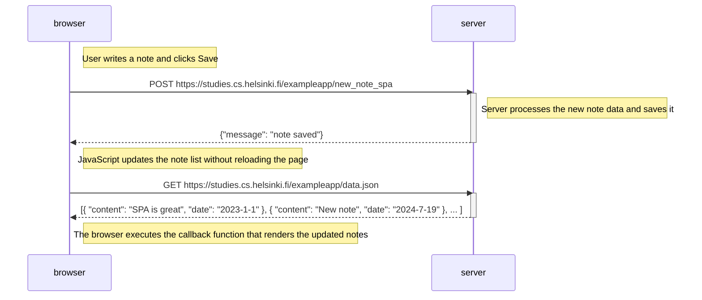

# Diagrams

## 0.6: Creating a New Note (Single-page App)

```mermaid
sequenceDiagram
    participant browser
    participant server

    Note right of browser: User writes a note and clicks Save

    browser->>server: POST https://studies.cs.helsinki.fi/exampleapp/new_note_spa
    activate server
    Note right of server: Server processes the new note data and saves it
    server-->>browser: {"message": "note saved"}
    deactivate server

    Note right of browser: JavaScript updates the note list without reloading the page

    browser->>server: GET https://studies.cs.helsinki.fi/exampleapp/data.json
    activate server
    server-->>browser: [{ "content": "SPA is great", "date": "2023-1-1" }, { "content": "New note", "date": "2024-7-19" }, ... ]
    deactivate server

    Note right of browser: The browser executes the callback function that renders the updated notes
```
